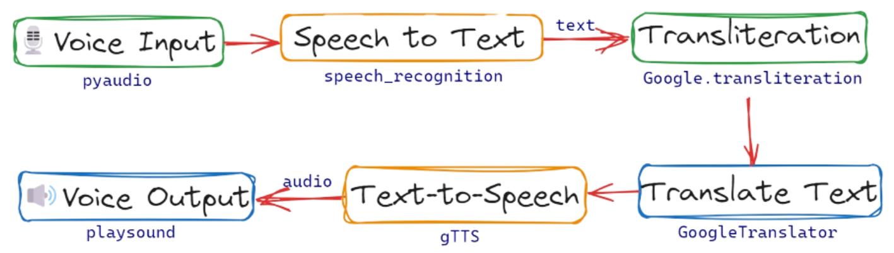
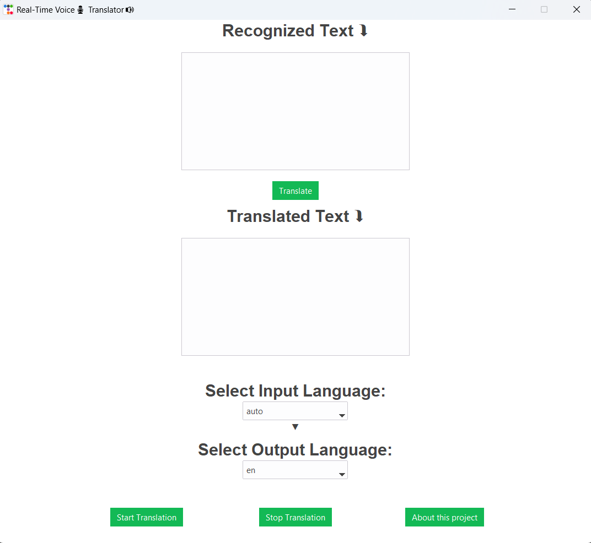

<div align="center">
<h1> Real-Time Voice Translator </h1> <a href="#"></a>
</div>

Real-Time Voice Translator is a machine learning project that aims to provide a seamless and natural experience of cross-lingual communication. It uses deep neural networks to translate voice from one language to another in real time while preserving the tone and emotion of the speaker. It is a desktop application that supports Windows, Linux, and Mac operating systems.

The application is easy to use: simply select the languages you want to translate between and start speaking. The application will listen to your voice and provide instant translations in real-time. You can also use the application to translate conversations between two or more people.

### Dependencies

    <=Python3.11, gTTS, pyaudio, playsound==1.2.2, deep-translator, SpeechRecognition, google-transliteration-api, cx-Freeze

### Getting started

1. Clone this project and create virtualenv (recommended) and activate virtualenv.

   ```
   # Create virtualenv
   pip install virtualenv
   virtualenv env


   # Linux/MacOS
   source env/bin/activate

   # Windows
   env\Scripts\Activate
   ```

2. Install require dependencies.

   ```
   pip install --upgrade wheel

   pip install -r requirements.txt
   ```

3. Run code and speech (have fun).
   ```
   python main.py
   ```

### Program Flow:

<a href="#"></a>

### GUI

<a href="#"></a>
